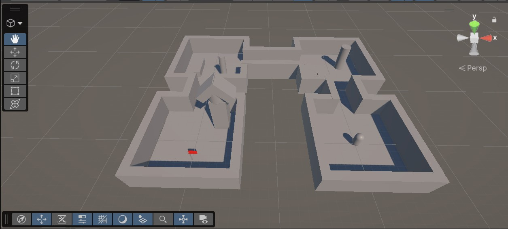
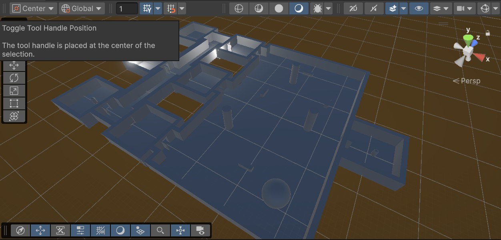
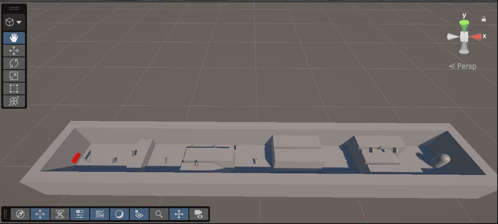
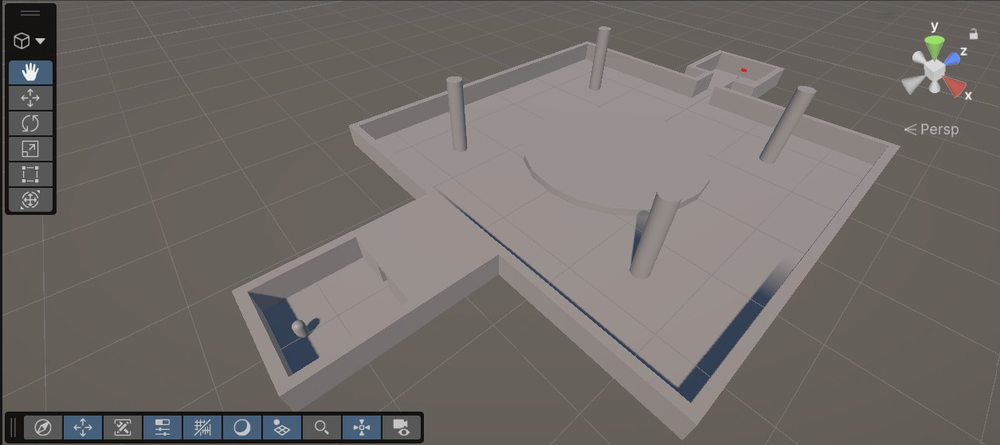
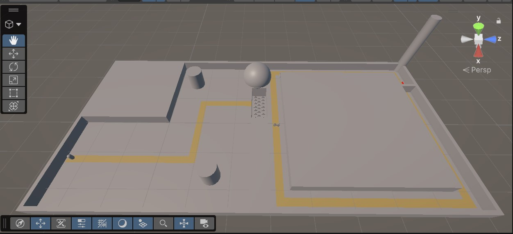

# CS464 Assignment 01 · [Muhammad Zakria Tahir] · [BSCS25103]
## Game 1 · [Angry Bird Friends]
- **Store link:** [(https://play.google.com/store/apps/details?id=com.rovio.angrybirdsfriends&hl=en)]
- **Genre:** [Puzzle]
- **I played:** [I Played for 20 minutes. Completed one tournament]
- **Video (optional):** [N/A]

1. [M1, M4] · [Opening Screen]
2. [M2] · [Game Level]
3. [M6] · [Other Game mode]
| # | Mechanic | Dynamic | Aesthetic | Bartle type |
|---|---|---|---|---|
| M1 |Multiple Block types varing in strength| By hitting the weak blocks you can crumle the hude fotress|Players try to finds weak spots to play efficently|Achievers|
| M2 |Tnts blast on Impact| Trageting the tnts cause more damage|Tnts exploding in sequence helps you gain more points easily|Achievers|
| M3 |Score system|Causing more envoirment destruction helps gain high score as well as completing the level|Players always try to gain high score to climb leadership board rather then only completing the level|Killers|
| M4 |Matilda drops a bomb|Dropping the bomb gives an upthrust which can be used to gain more distance or height| Players use Matilda to do double damage one with egg bomb one with body|Achievers|
| M5 |Bomb Blasts|People use bomb to get to the center and then blast him to do more damage in the core|Players effectively use bomb to use him as tnt|Achievers|
| M6 |The blues divides into three|More birds can cause more damage| People can use the blues birds to damage three builds at the same time if they are in range|Achievers|
| M7 |Bubbles grows into a massive ballon|Players can make it grow in size to cover more area|Players can either make him grow in the center to do more damage or make him grow midway to cover more damage area|Achievers|
**Aesthetic profile:** 
[Submission : Complete the level and always not using the best strategy to gain highest point is also an option. which makes it great game to spend a little bit of time
Challenge : Always thinking of the best way to cause maximum destruction and gaining highest point to climb the leadership]
**Player types**
- Primary: [Achievers] ([Acting] × [World]), because [players try their best play to gain the highest score in the level]
- Secondary: [Killers] ([Interacting] × [Players]), because [Playing against other players to beat them climb leadership board]

## Game 2 · [Minecraft]
- **Store link:** [(https://play.google.com/store/apps/details?id=com.mojang.minecraftpe&hl=en)]
- **Genre:** [sandbox]
- **I played:** [I Played for 20 minutes. Played for one in-game day]
- **Video (optional):** [N/A]

1. [M1, M4] · [Spawned in New World]
2. [M2] · [Day/Night Mechanism ]
3. [M6] · [Inventory System]
| # | Mechanic | Dynamic | Aesthetic | Bartle type |
|---|---|---|---|---|
| M1 | Day/Nigth Mechanism | Players wait till night to slay monsters to gain more XP| Getting overpowered by monster at night create frustation amoung new players| Achievers|
| M2 | Not sleeping triggers Phantoms| Player does not have to go to end everytime to get a new Elytra| Phantoms drop phantom membrane that repairs Elytra. To hunt them player spend sleepless nights| Achievers|
| M3 |Inventory System|Player has to manage the inventory. He cant carry everything|Player Plans what he needs what he does not need|Achievers|
| M4 |Dying clears the Inventory|Players try to use totems or carry health potion or foods to recover health to avoid dying|Losing a full set of netherite armours can make players very angry|Achievers|
| M5 | Crafting System |Players collect items to craft necessary and better things such as equiments to play efficiently|Players first full set of good armour is quite satisfying |Achievers|
| M6 | Monsters drop XP | Player create XP farms to Make things easy| Slaying Monsters to get XP for majority of new Players is knocking at deaths door |Achievers|
| M7 |Enchantments System|Players use farms to get XP fast so they can apply best echantments to their equipment| A fully enchanted Equipment makes the game play easy compared to when you spawn in a new world.|Achievers|
**Aesthetic profile:** 
[Fantasy: You as a Player, play the game to strength yourself to defeat various type of monster such as Ender Dragon. 
Fellowship : Minecraft allow cross-platfrom gameplay. You can play with your friends. Make amazing builds are play in fantasy servers. 
Challenge : Minecraft has many monsters (EnderDragon, Wither etc) defeating them is like overcoming a challenge. ]
**Player types**
- Primary: [Achievers] ([Acting] × [World]), because [Building Farms, Defeating Monsters, speedruns ]
- Secondary: [Socializers] ([Interacting] × [Players]), because [MC Servers, Creating builds, Completing story with your Friends ]

## Level blockouts
| Level | Screenshot | Its idea | Wayfinding tool |
|---|---|---|---|

| Level01 |  |Assassin's creed| Landmark|
| Level02 |  |Horror Game|Light and constrast|
| Level03 |  |Subway Surfers|Bread Crumbs|
| Level04 |  |Souls Game|Pinch and Release|
| Level05 |  |Wolverine|Leading Lines|

